Computer Graphics - Homework Assignment 6 - Shaders
===================================================

Goals:
------

* Understand how to program shaders that run on the GPU.

* Become familiar with setting up a modern GPU drawing pipeline.

* Understand cartoon shading.

* Understand texture coordinates.

* Understand tangent-space normal mapping.

* Understand how to compute a tangent-space from texture coordinates.

* Understand cube maps.

Getting Started & Handing In:
-----------------------------

* This is a programming assignment. The code framework is provided here.
framework from Piazza.

* The code will be written in GLSL (OpenGL shading language) and C++. You
are encouraged to write helper functions as you like.

* The program is GUI-based. I have included a Qt Creator project file
(`pipeline.pro`) so you can write, compile, debug, and run your program in
this IDE which you are familiar with. The code for this project makes
use of Qt only to setup an OpenGL window and deal with cross-platform
file system access. The rest is C++ standard library, glm, and GLSL.

* You should have already successfully installed the open source version
of the Qt environment from the last assignment:
<https://www.qt.io/download-open-source>
(At the time of writing, version 5.11 is the newest version. Any 5.x
version should work. The installer, by default, includes all versions of
Qt. Save space by installing only the most recent version and a
compiler.) Mac users with [Homebrew](https://brew.sh/)
can alternatively install via: `brew install qt` and `brew cask install qt-creator`.

* Download the assignment. This will create a folder named `pipeline`. Open the
file named `pipeline.pro`. This should launch the Qt Creator development
environment (IDE).

* There are separate downloads for three large examples. Unzip them and
move the `head`, `lemon`, and `hercules` directories into your
`pipeline/examples/` directory so that you end up with
`pipeline/examples/head`, `pipeline/examples/lemon`, and
`pipeline/examples/hercules`.

* Build and run the code. The code should compile. When it runs, it will
ask you to choose a JSON file specifying a scene. It can also be run
as a command-line program taking a single argument, the path to the JSON
file. That way you can specify a command-line argument in Qt Creator and
simply run. Run these two JSON scene files to verify that everything is
working. They don't depend on any code you write:

        simplegui.json
        sphere.json

    You should see:

    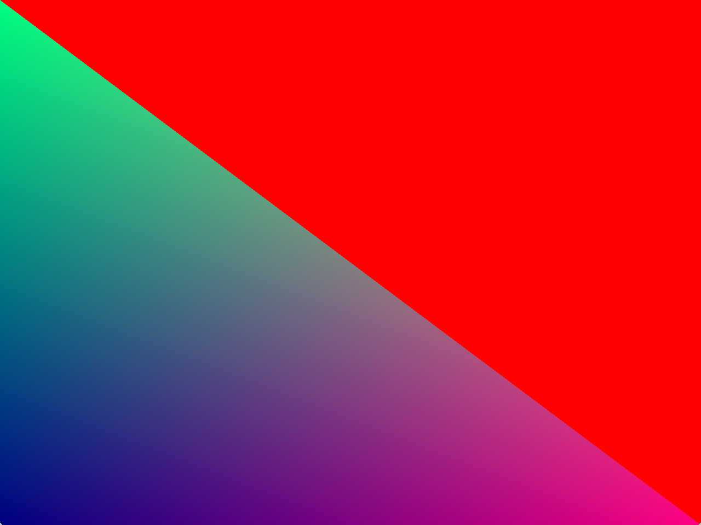
    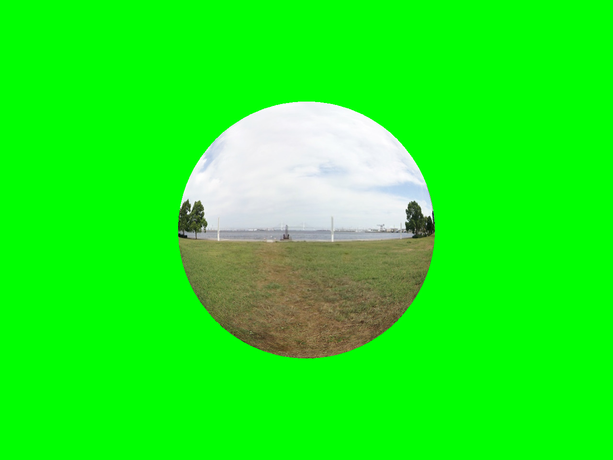

* Create your vertex shader and fragment shaders for each shader. Modify
the JSON scene files as needed. Tangent-space normal mapping will
require you to modify C++ code (`mesh.cpp`'s `computeTangentBitangent()`
and `glscene.cpp`'s `vaoFromOBJPath()`).

    * You should have filled in `mesh.cpp`'s other functions in the previous homework on [meshes](https://github.com/yig/graphics101-meshes).

* Build and run and test that it is working correctly. Here are the JSON
scene files that will verify your output.
The GUI supports saving screenshots. Save a screenshot for each of the JSON
scenes into an output subdirectory `screenshots`.

    * `phong_bunny.json`
    * `phong_sphere.json`
    * `cel_bunny.json`
    * `normalmap_cube.json`
    * `normalmap_head.json`
    * `normalmap_lemon.json`
    * `normalmap_hercules_bronze.json`
    * `normalmap_hercules_marble.json`
    * ... and any others that you make. You are required to make at least one (discussed below).

* Qt Creator has a great debugger for C++. For shaders, debugging is a bit
trickier. When there is a GLSL error, you will see the shader code and
the line number printed out to *Application Output* in Qt Creator.

* When done, zip your `pipeline` directory (except for the large
`head`, `hercules`, and `lemon` folders) along with the `screenshots`
subdirectory and a *Notes.txt* file as
*hw06_lastname_firstname.zip* and upload your solution to Blackboard
before the deadline. Your *Notes.txt* should describe any known issues,
including things you attempted but did not finish, and extra features.
Your *Notes.txt* should also note the names of people in the class who
deserve a star for helping you (not by giving your their code!).

* **THIS IS AN INDIVIDUAL, NOT A GROUP ASSIGNMENT. That means all code
written for this assignment should be original! Although you are
permitted to consult with each other while working on this assignment,
code that is substantially the same will be considered cheating.** In your
`Notes.txt`, please note who deserves a star (who helped you with the
assignment).

Overview:
---------

In this assignment, you will be writing GLSL shaders. You will write a
Phong shader (the same lighting model as in your ray tracer). You will
implement reflections with a cube map. You will load high resolution
normals from a texture and implement tangent-space normal mapping. (For
this, you will also need to implement some additional mesh processing to
create additional per-vertex attributes.) You will write a cartoon
shader. For bonus, you can also write additional shaders and write
OpenGL code to setup a different rendering pipeline. Your output will
look like this:

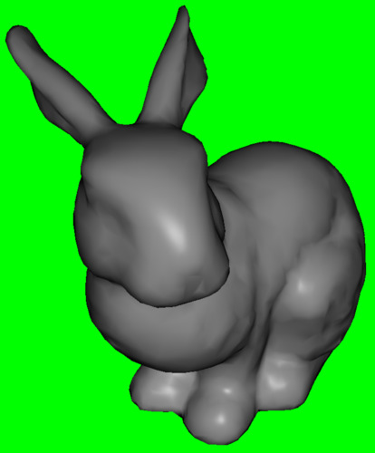
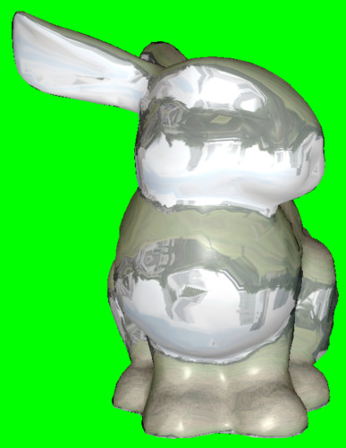
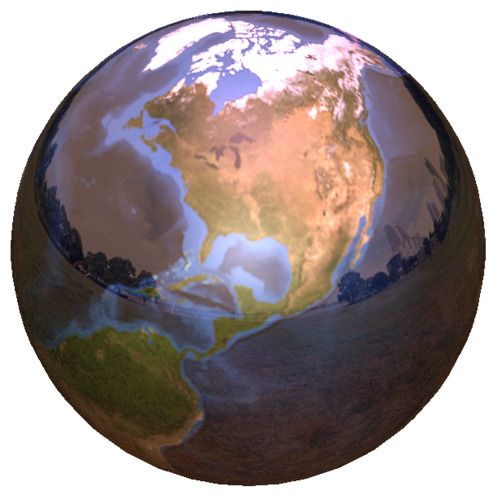
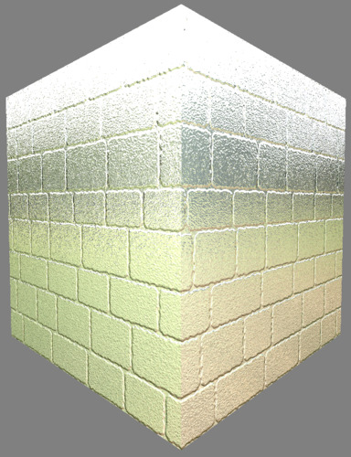
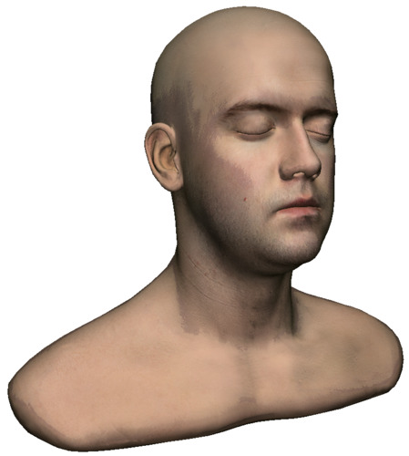
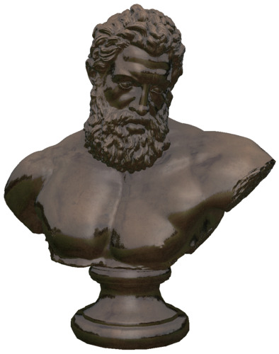

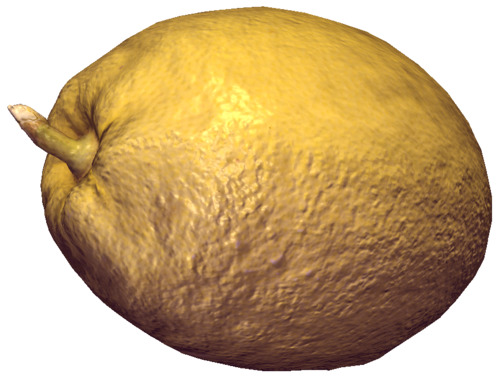

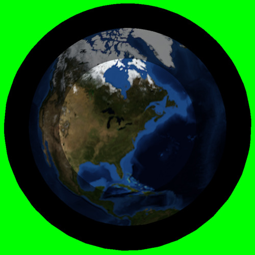

Rubric:
-------

1. **(30 points)** Phong reflectance model. Your vertex shader only
needs to transform the positions and normals. Your fragment shader is
where the lighting is calculated. This is the same lighting model as you
implemented for your ray tracer. However, you won't be able to implement
the global illumination terms the same way (shadow and reflection and
refraction). In this assignment, you won't be able to implement shadows
at all. The simplified formula is:
    
    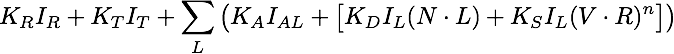

    $$K_R I_R + K_T I_T + \sum_L \big( K_A I_{AL} + \big[ K_D I_L ( N \cdot L ) + K_S I_L ( V \cdot R )^n \big] \big)$$
    
    *KR * IR +
    KT * IT +
    sumL (
        KA * IAL
        + [ KD * IL * ( N · L ) + KS * IL * ( V · R )n ] )*

    (Some equations are shown 3 ways because GitHub's Markdown processing doesn't handle math well.)

    Read on for details. In this assignment, all the parameters are stored as
uniforms, which are global variables for shaders programs. *KA*,
*KS*, *n*, *KR*, and *KT* refer to
`material.color_ambient`, `material.color_specular`, `material.shininess`,
`material.color_reflect`, and `material.color_refract`. If the boolean
`material.use_diffuse_texture` is false, then *KD* =
`material.color_diffuse`. If `material.use_diffuse_texture` is true, use *KD* =
`material.color_diffuse` times the color stored in the texture map:
*KD* = `material.color_diffuse*texture( material.diffuse_texture,
fTexCoord )`. The summation is over all `num_lights` of the `Light` structures;
*IAL* and *IL* refer to `lights[i].color_ambient` and
`.color`. The light `.position` should be interpreted as existing in eye-space,
not world-space. See *Tips* below for converting between world and eye space.

    * **(5 points)** Vertex shader `phong.vs`. Use the provided uniforms
`uProjectionMatrix`, `uViewMatrix`, and `uNormalMatrix` to transform the input
world-space position `vPos` and normal `vNormal` and pass them *out* to the
fragment shader and set the output variable `gl_Position`. Pass the
texture coordinate `vTexCoord` out unchanged.

        * `fPos`, `fNormal`, and `fTexCoord` are output variables, which is how you pass
along this information to the fragment shader, which is where you do
your lighting calculations. You can pass along `fPos` and `fNormal` in
world-space or in eye-space, so long as you use a consistent space when
you compute your lighting. (If you want to compute lighting in
world-space, you will have to convert the light position and the eye
position into world-space by multiplying them with `inverse(uViewMatrix)`.

        * `uViewMatrix` is the matrix that converts a position in world-space into a
position in eye-space: `uViewMatrix*p` converts `p` from world to
eye-space.
`uNormalMatrix` is the matrix that converts a normal from world-space to a
normal in camera-space. It is equal to
`transpose(inverse(mat3(uViewMatrix)))`.

        * `uProjectionMatrix` is the matrix that converts a position from
camera-space to normalized-device coordinates.

        * `gl_Position` is the one variable you are required to assign in any
vertex shader, so that the GPU knows which pixels are inside the
triangle. You must set `gl_Position` to the position in normalized device
coordinates.

    * **(20 points)** Fragment shader `phong.fs`. Implement ambient, diffuse,
and specular illumination.

        * **(2 points)** Ambient lighting: *KA IAL*. (In TeX, $K_A I_{AL}$.)

        * **(8 point)** Diffuse lighting: *KD * IL * ( N · L )*.
(In TeX, $K_D I_L ( N \cdot L )$).
*N* is the (normalized) surface normal vector
and *L* is the (normalized) vector from the surface position to the light's position.
Note that if this dot product is negative, then the light is behind the surface
and you should not add diffuse OR specular lighting.

        * **(10 points)** Specular lighting: KS * IL * ( V · R )n.
(In TeX, $K_S I_L ( V \cdot R )^n$.)
*V* is the (normalized) vector from the surface position to the eye position.
In eye-space the eye is located at the origin. *R* is the (normalized)
direction from the surface position to the light position, reflected
across the surface normal. The formula for reflecting a vector across
another vector is given below under *Implementation Details* (or you can
use the GLSL `reflect()` function). Note that if the dot product is
negative, then the light is reflected away from the viewer and you
should not add any specular lighting. (You can use
max( 0, V · R) instead of an `if` statement if you
desire.) Also note that if the dot product used for diffuse lighting is
zero (the light is behind the surface), then you also should not add
specular lighting.

    * **(5 points)** Implement reflections with a cube map (in the fragment
shader) if `material.reflective`. Use the *world-space* reflected view
direction as the parameter to the cube map: `texture( uEnvironmentTex, direction )`.
The resulting color is *IR*. If the direction you pass
to the cube map is in eye-space, it's as if the environment is rotating
with the viewer, which means that the reflection will not change as you
rotate the camera with the mouse.

    * **(bonus 5 points)** Implement refraction if `material.refractive`. Use
the same cube map texture as in reflections to get *IT*.
You can get the refraction direction via the GLSL `refract()` function.

2. **(20 points)** Cel or toon shading. You only need to write a fragment shader `cel.fs`,
since the same vertex shader as the one you wrote for Phong shading `phong.vs` can be re-used.
Cel shading is the lighting effect used in games like
*Zelda: Wind Waker* and *Breath of the Wild*, *Jet Set Radio*, and *Naruto Shippuden*.
To achieve cel shading, we compute a scalar brightness value,
round it to discrete levels, and then use that to scale the material color.
The scalar brightness value *F* is computed with a simplified Phong reflectance
in which no material colors *K* appear and the light color terms `.color_ambient` and `.color`
are simplified into scalar intensities:

    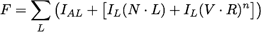
    
    $$F = \sum_L \big( I_{AL} + \big[ I_L ( N \cdot L ) + I_L ( V \cdot R )^n  \big] \big)$$

    *F = sumL IAL + IL * ( N · L ) + IL * ( V · R )n*

    Use the integer uniform `material.bands` to round *F* into discrete levels:
*Fdiscrete* = floor( *F* * *F* * `material.bands` )/( `material.bands` - 1).
(Squaring *F* makes the bands more uniformly spaced.) The final color
for a pixel is *K* * *Fdiscrete*, where *K* is the
material color. 
If the boolean `material.use_diffuse_texture` is false, then *K* =
`material.color_diffuse`. If `material.use_diffuse_texture` is true,
use *K* = `material.color_diffuse` times the color stored in the texture map:
*K* = `material.color_diffuse*texture( material.diffuse_texture, fTexCoord )`.
You will re-use your `phong.vs` and only write a different `cel.fs`.

3. **(40 points)** Normal mapping (`normalmap.vs` and `normalmap.vs`). This is an
extension of your Phong reflectance model shader. With normal mapping,
the texture stores a normal vector. Because lighting is entirely
determined by the normal vector, high resolution normals make a surface
look incredibly detailed. The normals in a normal maps are typically
stored as vectors in the *tangent space* of the surface. This technique
requires you to compute a "tangent frame" for each vertex (tangent and
bitangent vectors to accompany the normal) and upload that to the GPU as
additional attributes. To do this, you will implement `mesh.cpp`
`computeTangentBitangent()` to compute the tangent frame and `glscene.cpp`
`vaoFromOBJPath()` to upload the additional attributes to the GPU.
(Computing and uploading this additional data for this shader won't get
in the way of the other shaders.) Each face has a well-defined tangent
frame derived from the texture coordinates of its vertices; see the
accompanying handout for details. Just like with per-vertex normals, you
will pre-compute each face's tangent frame vectors and average them at
the vertices. In the vertex shader, you will convert the tangent and
bitangent vectors from world-space to eye-space (using `uViewMatrix`) and
pass them to the fragment shader. In the fragment shader, you will
extract the tangent-space normal from the texture and convert it to
world-space with the tangent frame matrix. That will be the normal you
use for your lighting calculations. (You can reconstruct the
tangent-frame matrix from the tangent, bitangent, and normal. Don't
forget to normalize them.) Implementation note: Normal components range
from [-1,1], while colors range from [0,1], so each normal component
is stored in the texture as `0.5*(n+1)`. Convert the color back to a
normal via `2*color-1`.

    * For a deeper explanation of the coordinate systems
    involved in tangent-space normal mapping, see [this PDF](docs/tangent_space_normal_and_bump_mapping.pdf).
    
    * For a video explanation of normal mapping, see [this YouTube video](https://www.youtube.com/watch?v=yHzIx41eiD4).

4. **(10 points)** Be creative! Create a time-varying artistic shader of
your own design. Make use of the uniform `uTime`, which stores the seconds
since the program was launched. Be sure to change `TimerMilliseconds` in
the scene JSON file to something like 16 (which corresponds to 60
frames-per-second).

5. **Bonus (variable points):**

    * Image Processing (blur, edge detect, etc.). Draw a full-screen textured
square. Your vertex shader should pass along the position and texture
coordinates, ignoring the view and projection transformations. Your
fragment shader accesses the texture value at the pixel and at nearby
pixels. You can use the GLSL function `textureSize( tex, 0 )` to get the texture
width and height in pixels so that you can generate texture coordinates
for the surrounding pixels.

    * Ray Tracer or Signed Distance Field renderer. Implement ray tracing or
ray marching (as in some [ShaderToy](https://www.shadertoy.com) examples).
Just like with Image Processing, the vertex shader does nothing. The
fragment shader implements an entire ray tracer or ray marching. All
geometry is specified via uniforms.

    * Animation. You can create a sequence of transformation matrices and
interpolate between them (linearly or with an easing function). You can
go further and implement linear blend skinning, in which there are
multiple sequences of transformation matrices animating in parallel, and
each vertex has a set of associated "skin" weights. The vertex is
transformed by the weighted average transformation matrix.

    * Ambient Occlusion. This provides a much more accurate surface ambient
color *KA* by computing the fraction of directions that are blocked
by the mesh (a ray exiting the point with that direction would intersect
the mesh). You can compute this in a pre-computation step or approximate
it with a multi-pass shader. When computing it as a pre-process, you can
store per-vertex attributes or a texture map.

    * Procedural textures. Generate a wood or marble color as a 3D function of
position.

    * Geometry or tessellation shaders. We haven't talked about these more
exotic shaders, but the framework supports them.

    * Physically-Based Rendering. There are many ways to pursue this. Note that the `lemon`
    example comes with a gloss map.

    * Something else!

Tips
----

* The glm library is modeled after the OpenGL shading language GLSL.
Anything involving `vec2`, `vec3`, `vec4`, `mat3`, `mat4`, etc. and virtually any
GLSL functions should be accessible in C++ with the `glm::` prefix.

* In C++ you can call the constructor of an object when you declare it,
like so:

        vec4 foo( 1.0, 2.0, 3.0, 4.0 );

    GLSL does not allow this and you will get a compile error. Instead, you
have to write:

        vec4 foo = vec4( 1.0, 2.0, 3.0, 4.0 );

* There is a simple, sample 3D shader in `sphere.json` / `sphere.vs` /
`sphere.fs`. (The simplest possible shader is in `simplegui.json` /
`simplest.vs` / `simplest.fs` and is based off the `simplegui.h/cpp` C++ setup
code.)

* To convert a position from world-space to eye-space, left-multiply the
provided uniform `uViewMatrix` by the position. To convert a normal from
world-space to eye-space, use the provided uniform `uNormalMatrix`, which
is the inverse-transpose of the upper-left 3x3 portion of `uViewMatrix`.
To convert a position or direction from eye-to-world, use `inverse( uViewMatrix )`.
To convert a direction (other than a normal) from eye-to-world, you can be
more efficient and use `transpose( uNormalMatrix )`.

* The GLSL function `texture(...)`, which loads a value from a texture,
returns a `vec4`. Some overly permissive OpenGL drivers will allow you to
use it as a `vec3`, but that behavior is wrong. Use `texture(...).rgb` to
get the RGB components as a `vec3` or call
`vec3(texture(...))`.

* To reflect a (not necessarily normalized) vector **v** across a
normalized vector **n**, the formula for the reflected vector **r** is
**r = -v + 2(v·n)n**.

    

    GLSL's `reflect()` function is different than the
formula and above diagram. GLSL's `reflect()` takes **v** pointed towards the
surface, not away from it (that is, negated), so `r=reflect(-v,n)`.

* All of the required portions of the assignment can use the same C++
setup code (defined in `glscene.cpp`/`glscene.h`) and differ only in which
shaders and uniforms are specified in the JSON file. (Only normal
mapping requires you to modify some of the C++ setup code.)

* You can achieve better code re-use in the shaders if you split them up. When
you specify a shader in the JSON file, you can pass an array of file paths which
will be concatenated together in sequence and then compiled. This allows you to
write common helper functions in a `common.glsl` file if you so desire. The
first line must always be a `#version` directive, so I often split my complex
shaders into `[ shaderTop.vs, common.glsl, shaderBottom.vs ]`. It may also make
sense to share a bottom but have different middles (e.g. normal mapping and
Phong shading could share a bottom but have different middle files implementing
an appropriate `get_normal()` function).

* You can create your own C++ scene if you want to customize the camera or
attributes. You will need to duplicate the proxy class (`SimpleGUI` or
`GLGUI`) and register it with `pipelineguifactory.cpp`. For reference, you
can see/study the simplest-possible OpenGL scene in `glsimplescene.h` and
`glsimplescene.cpp`.

* Almost everything in a JSON scene will live reload in if using a
`GLScene`, including shaders, uniforms, and textures. The only two
properties that will not live reload are `PipelineGUI` and
`TimerMilliseconds`.

* You can find lots of Creative Commons environment (cube) maps on the
website of Emil Persson, aka Humus:
<http://www.humus.name>

Qt functions you need for this assignment
-----------------------------------------

**None**
